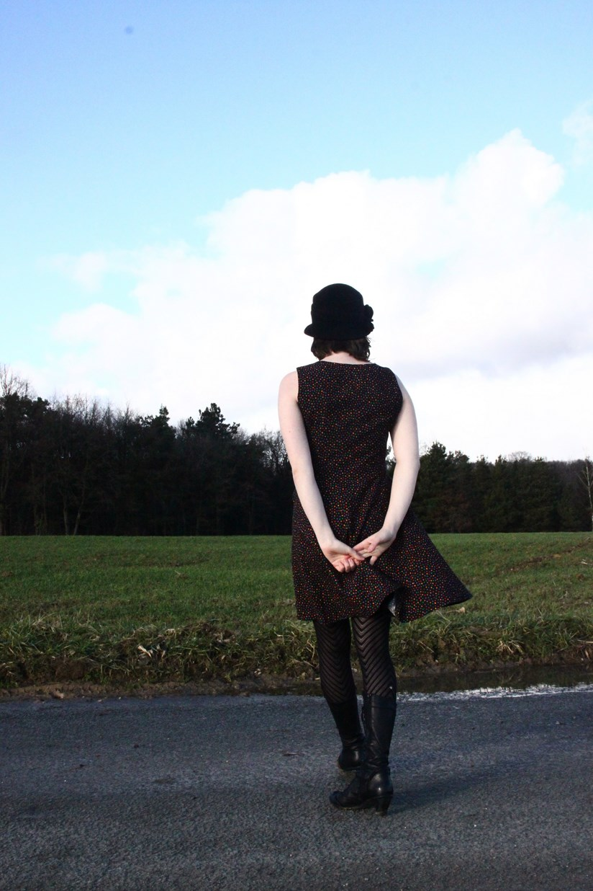

Title: Ma première robe
Category: Couture
Tags: couture, robe
Date: 2015-06-30 00:03
Slug: premiere-robe
Lang: fr

**Marque et Modèle :** tiré du livre "[Ma garde robe idéale](http://www.marabout.com/la-garde-robe-ideale-9782501096843)" 
**Taille :** 38 
**Métrage et Fourniture:**  
- Au moins 1m50 de tissu "confettis",  
- 1m de doublure de coton noire,  
- 1m de doublure de satin polyester.  
- 1 fermeture éclair (récupérée chez ma mamie) 

Ceci est la première robe que j'ai cousue.

C'est aussi un de mes premiers projets. J'ai commencé à coudre en allant à [La Couserie](https://www.facebook.com/lacouserie?fref=nf). La Couserie, c'est une association mulhousienne géniale qui regroupe dans un même local des machines à coudre, des bouquins de couture et patrons, et surtout des couturières/tricotteuses ultra motivées.

Donc en arrivant là bas j'ai commencé à coudre, d'abord des shorts (chataignes). Et puis cette robe : 

<figure>
	
	<figcaption> Ma première robe (surnommée la robe confettis)</figcaption>
</figure>

Initialement, cette robe est un test. Un test pour tester la coupe, le modèle, la taille, bref un test. 
On m'a donné le tissu avec la seule condition que si le résultat final n'était pas trop désastreux, il fallait que je la porte. Et pour cela pas de soucis ! 

C'est une robe à découpes princesses, ce qui lui donne un très joli tombé, je trouve. 

De plus, c'est un modèle entièrement doublé. J'ai doublé le corps avec du coton (pour le confort), et la jupe avec un satin pour qu'elle n'accroche pas aux collants (pour le confort également). 

<figure>
	
</figure>

Ce test est plus que conclulant ! 
Si je ne l'ai pas encore refait, c'est parce que j'ai fait des modifications que je n'ai pas reporté sur mes calques du patron.  
- J'ai creusé l'encolure parce que je trouvais que l'encolure bateau que proposait le patron ne m'allait pas.  
- J'ai repris les découpes princesses du dos pour que la coupe suivent ma cambrure.  
- J'ai racourcis la robe d'au moins 10 cm. 

Et voila, cette robe est géniale, confortable et superbe :) 
et en plus elle tourne !!!
<figure>
	
</figure>

PS : Cette robe a été cousue en novembre, photographiée en février par 4°C (c'etait frisquet), et à l'honneur pour mon premier article couture fin juin. Cette robe aura traversé l'année ! 