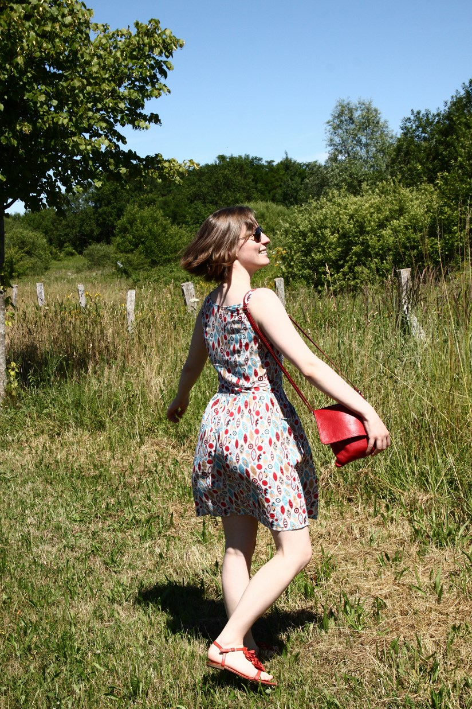

Title: Ma robe grecque
Category: Couture
Tags: couture, robe
Date: 2015-06-30 09:53
Slug: robe-grecque
Lang: fr

**Marque et Modèle :** "Gathered Sundress" de Pattern Runway  
**Taille :** 38  (sauf à la taille : 40)  
**Métrage et Fourniture:**  
- 2m de tissu "grec",  
- 1 fermeture éclair,  
- 2m de biais blanc

Allez hop ! On commence la saga des robes. Celle ci c'est la robe dite grecque, parce que les motifs du tissu me font penser à la Grèce.

Ce tissu je l'ai vu à tissu éco. Une caverne d'Ali Baba de tissu, il y a des rouleaux du sol au plafond, et cachés au mileu de tous ça, il y a des merveilles ! 
Donc ce tissu je l'avais vu d'abord là bas, et j'avais été raisonable, je m'étais retenu de l'acheter. Mais ma raison n'a pas tenu longtemps quand je l'ai recroisé 2 jours après, le dimanche matin sur le marché à 1€ le mètre. C'est bien simple, j'en ai pris 2 mètres :)

<figure>
	
	<figcaption> Regarder ce super tissu !</figcaption>
</figure>

Ce tissu est fin (plutôt beaucoup même par rapport aux précédents tissus que j'ai cousu), il tombait vraiment bien parce qu'ici le climat vraiment continental commence à se faire sentir. 
Donc j'avais envie d'une robé d'été légère. Pour le patron, j'ai choisi de coudre la "Gathered Sundress" (histoire de rester dans le thème de l'été). 

<figure>
	
	<figcaption> Ici, on voit ces super poches !</figcaption>
</figure>
Donc parlons un peu de ce modèle :
Moi jai trouvé agréable de la coudre, tout c'est passé sans problème, à part la ceinture où j'ai au début inversé le "front" et le "back", du coup ça collait pas, mais c'est de ma faute.
Sur ce modèle, il y a  :  
- des découpes princesses, et j'aime bien cela :)  
- des poches, et c'est plutôt pratique.  

Les modifications que j'ai réalisées sont de : 
- réduire d'au moins 3 cm de chaque coté pour que le corps de la robe soit plus ajusté à ma taille. 
- supprimer la doublure, parce que je voulais vraiment que cette robe soit légère. 
- raccoucir la jupe de 10 cm, pour qu'elle m'arrive juste au dessus du genoux. 

<figure>
	
	<figcaption> et là, si on plisse les yeux, on voit les découpes princesses</figcaption>
</figure>
Les modifications que j'ai réalisées sont de : 
- réduire d'au moins 3 cm de chaque coté pour que le corps de la robe soit plus ajusté à ma taille. 
- supprimer la doublure, parce que je voulais vraiment que cette robe soit légère. 
- raccoucir la jupe de 10 cm, pour qu'elle m'arrive juste au dessus du genoux. 

 et en plus elle tourne (un peu :))

 <figure>
	
</figure>

Je la referais bien en mettant en valeur ces fameuses découpes comme [l'Énervée de la machine à coudre](http://lenerveedelamachineacoudre.blogspot.fr/2015/05/retrospective-davril-3-gathered-sundress.html), pour les faire corespondrent avec la forme des poches.