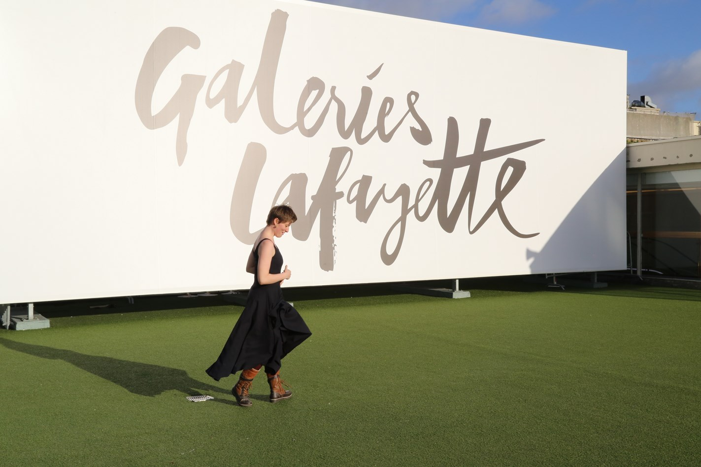
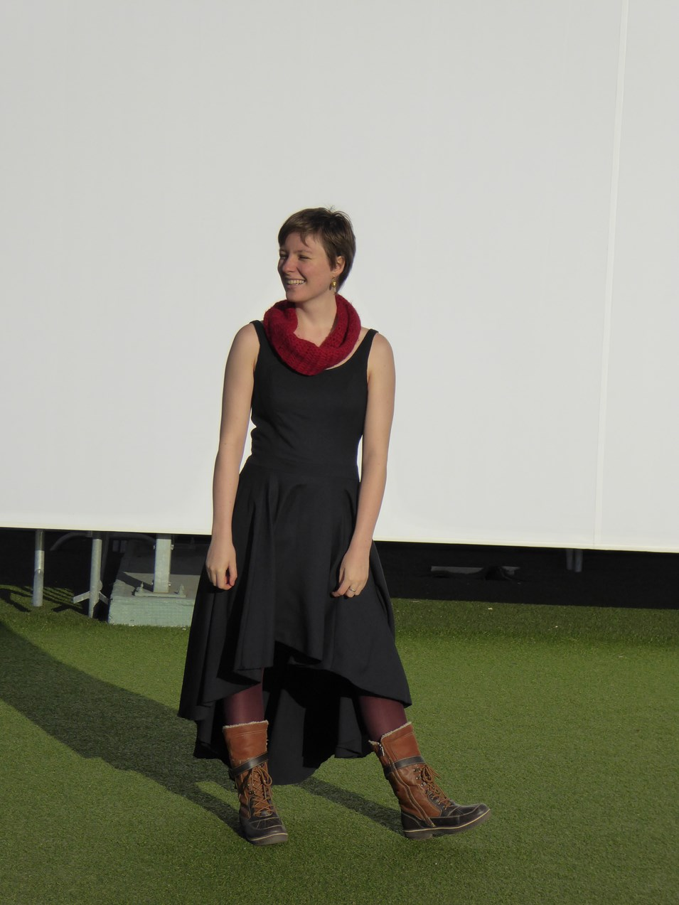
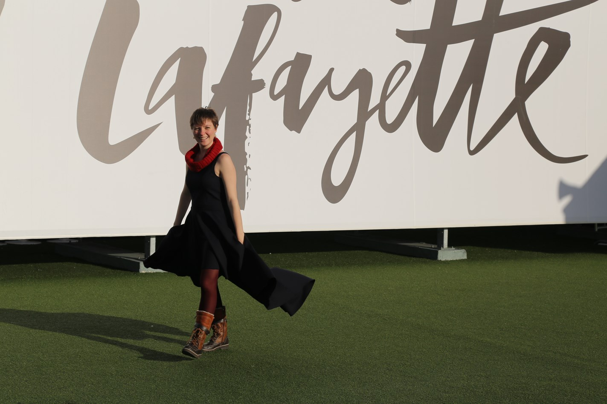
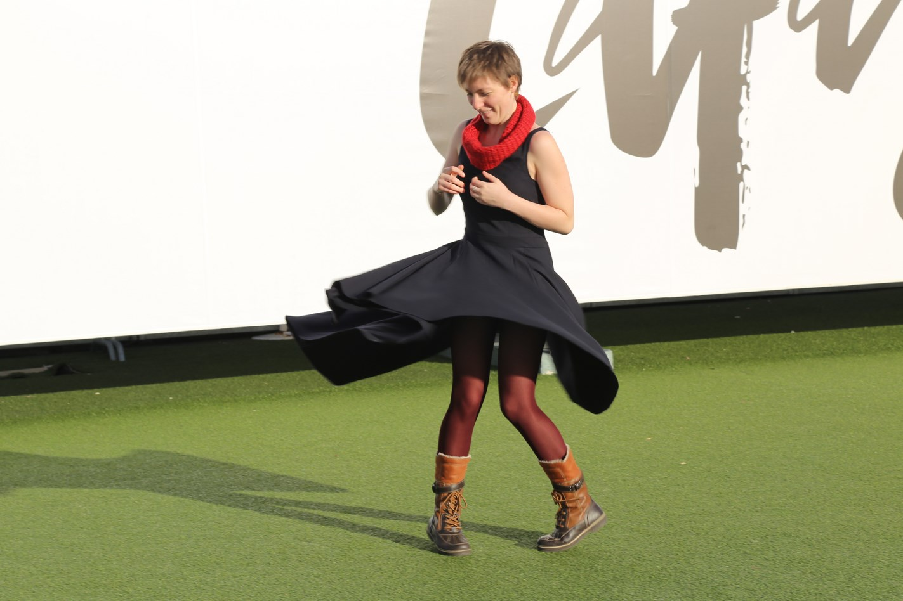
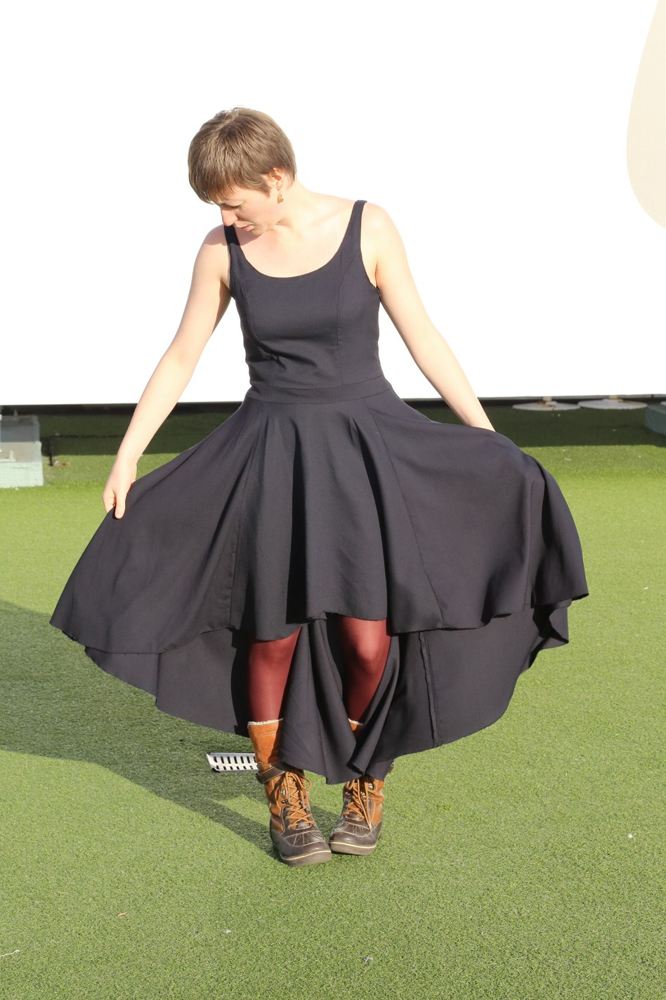
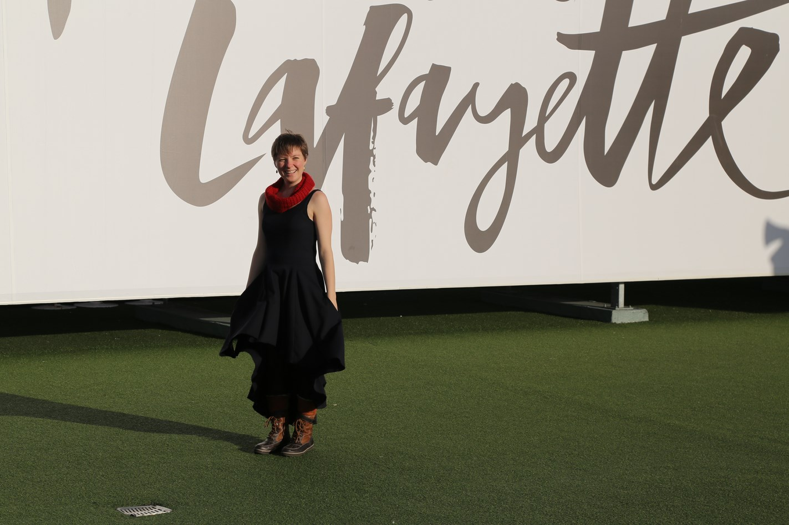
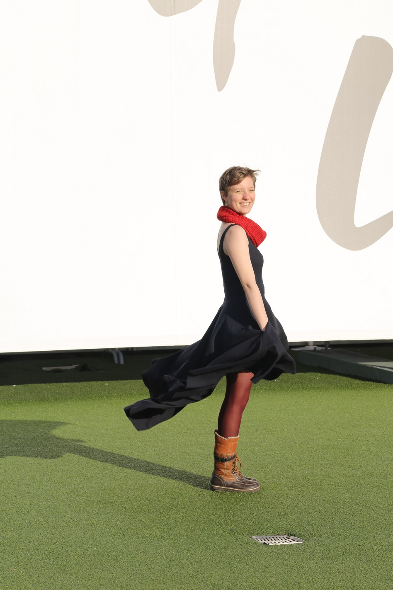
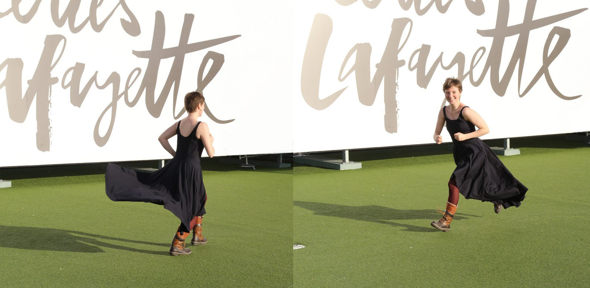
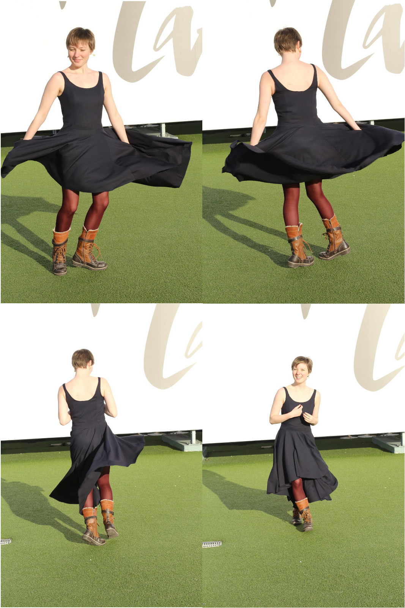

Title: La roble agla-gala-gla
Category: Couture
Tags: couture, robe
Date: 2015-12-31 12:00
Slug: robe-aglagalagla
Lang: fr

**Marque et Modèle :** ["Gathered Sundress" de Pattern Runway](http://patternrunway.com/shop/gathered-sundress-pattern/), modification de la jupe 
**Taille :** 38  
**Métrage et Fourniture:**  
- 3m (environ peut être un peu moins) d'un tissu bleu marine (aucune idée de la composition), 
- 1m (peut être un peu moins) de coton gratté pour la doublure du corps, 
- une longue fermeture éclair,  

BONNE ANNÉE 2016 ! 

<figure>
	
</figure>

Cette robe c'est ma robe de gala. Ou plutôt c'est la robe que j'ai confectionnée pour cette occasion. 
Le thème de cette année était "Les années 20". J'adore ce thème, mais ce n'est quand même pas le style que je porte tous les jours. Et puis si je me faisais une robe dans ce style je veux des franges sur toute ma robe et je n'ai pas de ruban frangé dans mon stock. (un jour peut-être : affaire à suivre). 

Mes exigences pour cette robe étaient : 
- une robe confortable  
- que je puisse reporter en dehors d'un gala, (mais qui fasse quand même fête...)  
- et condition supplémentaire :  une robe faite avec que les fournitures de mon stock. 

<figure>
	
</figure>

Oui, je viens de faire l'inventaire de mon stock et j'ai malgré tout beaucoup de tissus. Certains ont des projets qui leur sont destinés (il me manque juste du temps en somme), d'autres ils en avaient quand je les ai achetés mais il semblerait que j'ai oublié ou qu'ils ne conviennent plus à ce que je veux, ceux là, il leurs faut de nouveaux projets. 

J'ai fait le choix du modèle de cette robe quand j'ai vu la [Reglisse de Deer&Doe](http://boutique.deer-and-doe.fr/robe-reglisse.html) avec une jupe assymétrique de [Quand le chat n'est pas là](http://lamiphoque.canalblog.com/archives/2015/11/11/32896153.html). Une jupe assymétrique ça fait fête !!! 
Pour le buste, j'ai choisi le patron de la ["Gathered Sundress" de Pattern Runway](http://patternrunway.com/shop/gathered-sundress-pattern/) que j'ai déjà fait sur [ma robe grecque](http://mllecarnot.org/robe-grecque.html). Donc j'ai repris les ajustements que j'avais déjà fait (resserrement du buste), et je l'ai allongée d'au moins 3 cm.
J'ai tracé la jupe selon [le tuto de Deer&Doe](http://blog.deer-and-doe.fr/2556-reglisse-sew-along-creer-une-jupe-asymetrique/).

<figure>
	
</figure>

Pour le choix du tissu : j'avais ce tissu bleu dans mon stock depuis au moins un an (il doit faire partie des premiers tissus que j'ai achetés à [Tissu Eco](http://www.tissu-eco.com/)), il n'avait pas vraiment de projet qui lui était destiné. Et il est relativement lourd, je comptais dessus pour un beau tombé de la jupe cercle (et je trouve que c'est réussi ;) ).

<figure>
	
</figure>

Allez hop ! J'avais toutes mes idées en tête et je mis suis mise le 11 novembre. Décalcage, découpage, couture ! J'ai fini le corps de la robe dans la journée.
Simplement voilà, ce tissu a un beau tombé mais alors il n'est pas du tout agréable au contact direct de la peau. 

<figure>
	
</figure>

Il me fallait une doublure, sauf que le 11 novembre touche à sa fin. 
Mais le souci c'est que dans la semaine qui suit, le jeudi il y a le Congrès Industriel. [Le Congrès Industriel](https://ae.utbm.fr/congres/) c'est le forum Entreprises-Etudiants de l'[UTBM](https://www.utbm.fr/) (l'école où je suis), et c'est moi qui l'ai organisé avec toute une équipe ! (je reviendrais dessus dans un prochain article). Donc la semaine en question n'est pas du tout de tout repos. 

Autant vous dire que j'étais crevée et quand j'ai fini ma robe le vendredi soir (tard) je ne tennais plus vraiment debout. Donc il ne faut pas regarder la doublure de trop près. Le montage, ça ne va pas du tout ! Je pense que je vais la démonter et la remonter tranquillement. (ça me fera un entrainement, parce que là j'ai un peu galéré. J'ai commencé par coudre toute ma doublure en m'appliquant. Ah ! elle était super bien posée, mais on ne pouvait plus la retourner --'... Bref, j'ai des trucs à revoir sur ce point là).

<figure>
	
</figure>

J'ai l'ai porté le soir du Gala ! (j'étais très fière de moi, mine de rien). 
D'ailleurs j'ai rencontré, une belladone. Je suis allée la voir, en lui disant cash : "Dis c'est pas une belladone de Deer&Doe que tu portes ? C'est toi qui l'a fait ???". C'était une ancienne de l'UTBM, du coup, on a parlé couture bien sur, de l'UTBM et un peu de tout :)

(Je n'ai pas de photos du gala, les photos où j'étais présente ont disparues dans un vide intersidéral. L'équipe du gala espère qu'elles réapparaitront un jour.)

<figure>
	
</figure>

Donc pendant les vacances de Noël, je suis montée à Paris. Et j'ai décidé de porter ma robe, je me disais que ça pourrait être l'occasion de belles photos. 
On est monté tout en haut des galeries Lafayette. Il y a une terrasse panoramique qui offre une superbe vue sur Paris. 
Et puis il y a cette pancarte immense ! C'était l'occasion :)
Lorsque ma maman a commencé à prendre des photos, des gens présents sur la terrasse ont du penser qu'ils assistaient à une sorte de shooting. Je pense qu'ils ont vite compris que c'était amateur quand je me suis mise à courir pour "qu"il y ait du mouvement dans ma robe :)"

<figure>
	
</figure>

Mine de rien, j'aime bien l'effet de cette robe. En plus, elle tourne ! 

<figure>
	
</figure>

PS : C'est ma robe de gala et de premier de l'an (Rassurez-vous, je n'étais pas en bottes fourrées pour ces occasions) :-)

