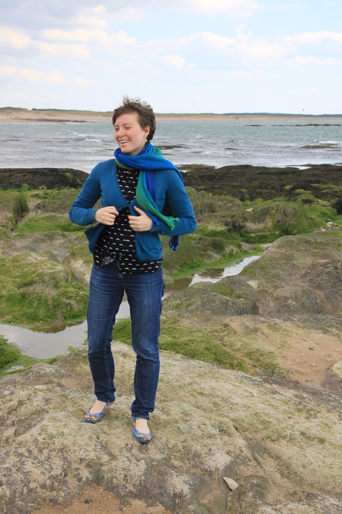

Title: Le (mystérieux) cas de l'imprimé moustache. 
Category: Couture
Tags: couture, chemise
Date: 2015-04-03 12:00
Slug: mystere-moustache
Lang: fr
Status: draft

**Marque et Modèle :** ["Cami" de Pauline Alice](http://www.paulinealicepatterns.com/robe-cami) déjà réalisée [ici](http://mllecarnot.org/robe-madras.html) et [là](http://mllecarnot.org/robe-ikat.html) retravaillé pour en faire un chemisier
**Taille :** plutôt 40  
**Métrage et Fourniture:**  
- 135 cm (par 140) de tissu à moustaches acheté à Mondial Tissu  
- boutons 

Tout le mystère réside dans le : Pourquoi j'ai acheté ce tissu ? 

<figure>
	
	<figcaption>Chemisier Moustaches en conditions réelles de portabilité</figcaption>
</figure>

J'ai acheté ce tissu lors de ma première virée à Mondial Tissus, il y 1 an et demi, quand j'haitais encore Mulhouse. Je venais de découvrir la couture en autonomie :)
Il y a un an et demi, c'était la mode des moustaches. Enfin des imprimés moustaches, lunettes, tout ça tout ça. On en trouvait partout. 
Et bien moi, qui n'avait jamais eu de tels imprimés dans mon armoire j'ai craqué (en même temps c'était ma première virée dans un magasin de tissus en tant que jeune couturière, et ça n'a pas été la virée la plus "safe" pour mon porte-monnaie (*mais les virée dans les magasins de tissus ont elles été un jour "safe" pour les porte-monnaies?*)). 

<figure>
	
</figure>

Et ensuite..
avec le butin de cette virée, j'ai fait 2 shorts chataignes (mes toutes premières cousettes). et le reste a commencé à constituer mon stock de tissus.

Aujourd'hui, un an et demi après et 2 déménagements, mon stock à la taille d'un buffet (plein !). Des Forces extérieures et persuasives (totalement indépendantes de ma volonté, mais malheureseument pleines de bon sens) me poussent à diminuer mon stock (avant de le reconstituer). 

<figure>
	
</figure>

Donc je me suis attelée à la tâche de faire tous les vêtements que j'avais prévu lors de l'achat des tissus. 
Dans le cas (comme celui-ci) où je ne sais plus pourquoi j'ai acheté ce tissu, j'en fais ce que je veux. Je l'ai utilisé pour une expérimentation ! 

<figure>
	
</figure>

Je viens de finir une cami Dress (la troisième) (*oui oui je vais vous la montrer mais je ne l'ai pas encore portée (donc elle n'est pas encore vraiment approuvée), je n'ai pas encore décidé si je changeais les jupes ou pas. C'est en réflexion intense...*). 
Bref je viens de finir ma troisième Cami, et avec les petites modifications de rallongement du buste, je trouvais que le corsage était parfait. 
Je suis partie de cette base pour en faire une chemise. 
et voilà ce que ça donne ! 

<figure>
	
</figure>

Je vous avoue, j'ai eu de gros doute sur l'imprimé lors de l'essayage. *On m'a proposé d'ouvrir un restaurant de burger".* Je me dis qu'il y a peut être une raison, pourquoi j'ai ce type d'imprimés dans mon armoire. Mais je me dis aussi que la couture c'est fait pour faire des expérimentations aussi bien sur les formes que sur les imprimés :)

<figure>
	
</figure>

Bref, j'ai levé le doute avec une demande express sur instagram, on m'a assuré que c'était office-compatible (*merci pour vos retours !*). 
Du coup, ni une ni deux, je l'ai portée le lendemain au bureau. 
Aucun souci à noter, en plus je la trouve hyper confortable. Elle est ajustée à la poitrine, mais pas du tout au corps. Je reste libre de mes mouvements sans qu'on ait l'impression que j'ai des épaules de camionneur. Si je la rentre dans un pantalon, elle a un petit effet blousant (on m'a dit que ça faisait encore plus working girl ^^).

<figure>
	
	<figcaption>Conditions réelles de portabilité : même roulée en boule ça marche </figcaption>
</figure>

Pour la faire, comme je vous le disais, j'ai repris le corsage de la cami dress et j'ai un peu bidouillé la fin pour avoir la forme d'une chemise. (je pense vous expliquer comment j'ai procédé dans un prochain article :) )

<figure>
	
	<figcaption>Oh, mais il y a du soleil !</figcaption>
</figure>

Donc récapitulons, les modifications : 
- Corsage de la cami Dress alongé de 4 cm. 
- Partie basse en forme de chemise
- Col mao (soit que le pied de col)

- Et je pense que la fin des pinces devant peuvent être améliorées. 

<figure>
	
	<figcaption>Ouiii j'veux du soleil</figcaption>
</figure>

Je suis très satisfaite de ce chemisier. J'en suis d'autant plus fière que c'est moi qui l'ai modifié pour avoir le résultat attendu :)

<figure>
	
		<figcaption>Youupi ! </figcaption>
</figure>

